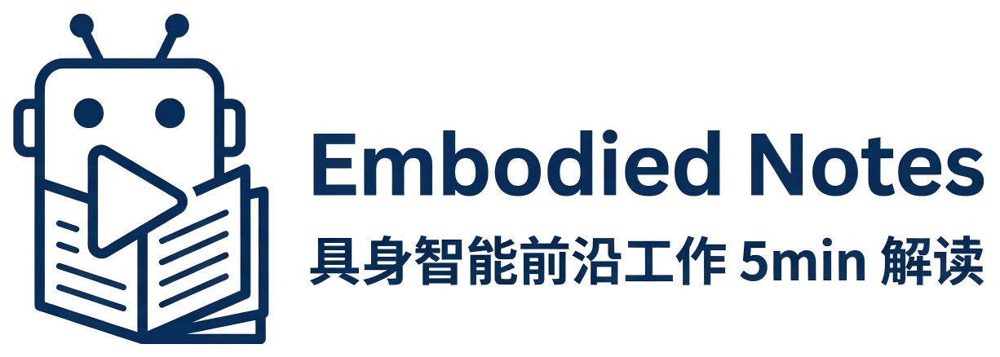

  

# Embodied Notes / 具身智能前沿工作 5min 解读

> 一个围绕具身智能前沿工作的个人解读仓库😊。  
> 每期内容对应一条 5min 视频，并附上论文 / 项目网站 / 公司链接。  
> 适合想快速了解最新具身智能工作的爱好者🤖。

---

## 🔥News｜更新记录

- 2026-03-21：仓库创建 & logo
- 2026-03-22：EP01
- 2026-03-25：EP02
---

## 🚀Start Here｜从这里开始

如果你是第一次来到这个仓库，建议这样使用：

1. 先看「最新视频解读」
2. 再按「主题」找你感兴趣的方向
3. 每一期都附了原论文、项目页、代码
4. ./assets/contexts 里面有每一期的视频文稿

---

## 🎥Latest Videos｜最新视频

| 日期 | 标题 | 主题 | 链接 |
|------|------|------|------|
| 2026-03-22 |5min看懂NVIDIA2月新作--DreamZero/什么是WAM? | WAM / 世界模型 | [Bilibili](https://www.bilibili.com/video/BV1u5QQBxE8J/?share_source=copy_web&vd_source=e04fab70977b1b2117cf35c1a17faa06) |
| 2026-03-25 |5min告诉你WAM为什么这么强？Fast_WAM/GigaWorld-Policy解读 | WAM / 世界模型 | [Bilibili]() |

---

## 📚Episode Template｜单期内容模板

### EP01｜5min看懂NVIDIA2月新作--DreamZero/什么是WAM? 

**对象**：  
- 公司 / 实验室：NVIDIA
- 论文 / 项目名称：DreamZero: World Action Models are Zero-shot Policies
- 发布时间：2026-02-19

**原始链接**：  
- Paper：https://arxiv.org/pdf/2602.15922
- Project Page：https://dreamzero0.github.io/
- Code：https://github.com/dreamzero0/dreamzero

### EP02｜5min告诉你WAM为什么这么强？Fast_WAM/GigaWorld-Policy解读

**Fast-WAM**：

**对象**：  
- 公司 / 实验室：Tsinghua University/Galaxea AI
- 论文 / 项目名称：Fast-WAM: Do World Action Models Need Test-time Future Imagination?
- 发布时间：2026-03-23

**原始链接**：  
- Paper：https://arxiv.org/abs/2603.16666
- Project Page：https://yuantianyuan01.github.io/FastWAM/
- Code：https://github.com/yuantianyuan01/FastWAM

**GigaWorld-Policy**：

**对象**：  
- 公司 / 实验室：GigaAI
- 论文 / 项目名称：GigaWorld-Policy: An Efficient Action-Centered World–Action Model
- 发布时间：2026-03-24

**原始链接**：  
- Paper：https://arxiv.org/pdf/2603.17240
- Project Page：https://gigaai-research.github.io/GigaWorld-Policy/
- Code：https://github.com/open-gigaai/giga-world-policy
---
